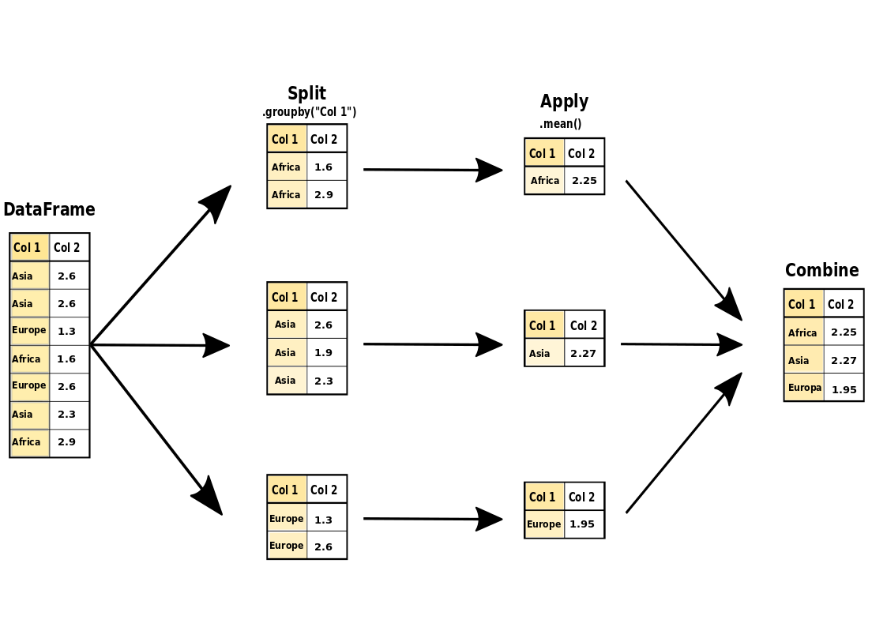
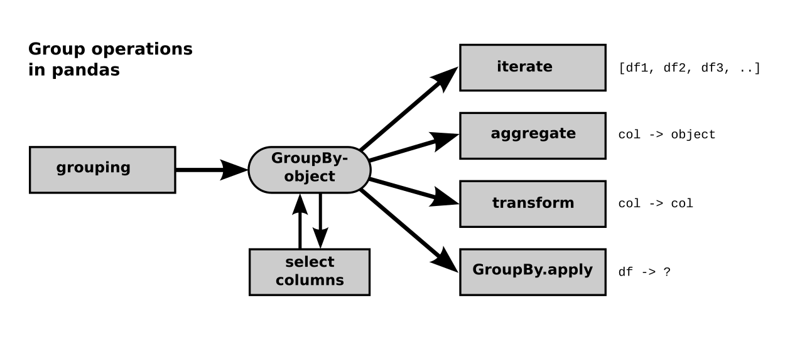

Aggregation
===========

The ``DataFrame.groupby()`` statement is very powerful for data wrangling in Python.
The main concept to understand  **Split-Apply-Combine**.

- **Split** the data into groups based on some criterion
- **Apply** an aggregation function to each group
- **Combine** the results to a new DataFrame

----

Examples
--------

.. literalinclude:: example.py

----

Split
-----

How do you want to split your initial DataFrame? There are **multiple options**:

.. literalinclude:: ex_grouping.py

You can iterate over the groups and inspect each of them separately:

::

  for i, df_group in df.groupby('species'):
      print(i, df_group, '\n')

----

Apply
-----

There are three types of functions that you can apply to your groups:

1. Simple Aggregations
++++++++++++++++++++++

In a simple aggregation, **the size of the result is the number of your groups**.
What aggregation functions can you use?

.. literalinclude:: ex_aggregation.py

2. Transform
++++++++++++

When using ``.transform()``, the size of the result stays the same.
The result of your aggregation functions is projected to all elements it was calculated from.

.. code:: python3

   # Transform by function name
   g.transform('mean')
   
   # Transformation by function reference
   g.transform(len)
   
   # Transformation with your own function
   def normalize(array):
       return array - array.mean()
   
   g.transform(normalize)
   

3. Apply
++++++++

The generic ``.apply()`` takes each pd.Series of a pd.DataFrame as input,
applies a specified function to all of them and returns,
depending on the specified function, either a pd.Series or a pd.DataFrame
of flexible size. It aggregates over the pd.Series or not at all.

.. code:: python3

   def first_two(df):
       return df.head(2)
   
   g.apply(first_two)

----

Combine
-------

In the last step, the results from each group are combined into a new DataFrame.
Pandas takes care of this step for you automatically.

Recap
-----

.. seealso::

   -  `Dunder Data Challenges <https://mybinder.org/v2/gh/DunderData/Dunder-Data-Challenges/master>`__
