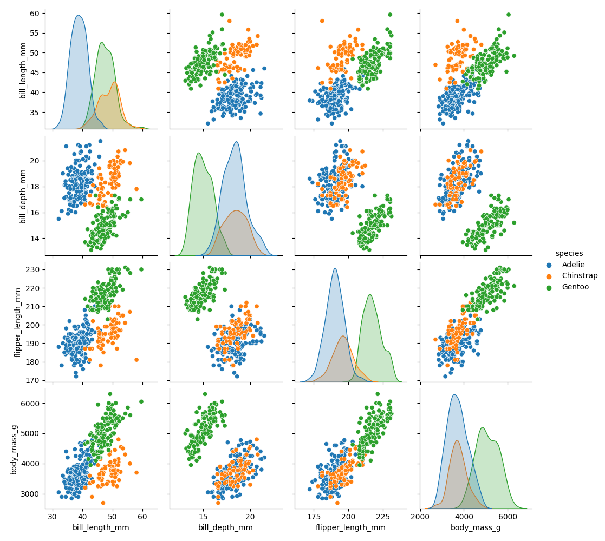
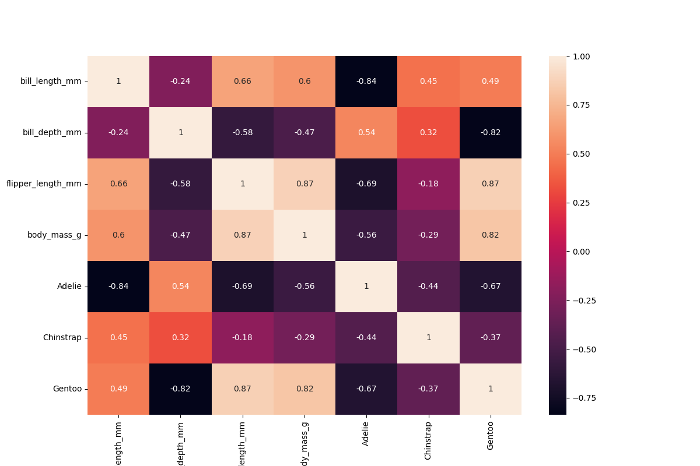

Descriptive Statistics
======================

Encounter with Penguins
-----------------------

.. card::
   :shadow: lg

   You have finally found a colony of the legendary space penguins.
   They live on an icy planet with oceans and many islands.
   The strange creatures seem to be comfortable spending lots of time in water.
   They also seem to be very resistant to cold.
   Moreover, the penguins seem to be an intelligent species.
   Establishing communications with them could be fun.

   But you decide to start with a preliminary scan of the colony:

   .. code:: python3

      import seaborn as sns

      df = sns.load_dataset("penguins")

The Goal of Descriptive Statistics
----------------------------------

Once your data is tidy and you have created a few exploratory plots, you usually want to describe your data in more detail. This is where **Descriptive Statistics** come in. This is an obligatory step whenever you are working with data whether you want to deliver an expert opinion, train a fully automated Machine Learning algorithm or monitor data in production.
Statistics go very deep sometimes, but you can safely start with a few straightforward metrics. You find an overview here.

A good step to start with is to **write down questions** you are interested in.
E.g.:

* how many penguins are there?
* how large are the beaks of penguins?
* are there any subgroups of penguins?
* are there any exceptionally small or tall penguins?

The descriptive statistics metrics help you to come up with answers that are numbers.
Let's look at a few of them.

----

Measures of Centrality
----------------------

When looking at a single variable (a column in your tidy data), the first thing you want to know is where the data is located. The three metrics to start with are:

The arithmetic mean
+++++++++++++++++++

The **arithmetic mean** is the sum of all data points divided by their number:

.. math::

   \bar x = \frac{1}{n} \sum_i (x_i)
   
It can be calculated in a single line:

.. code:: python3

   df["bill_length_mm"].mean()

Often, you want to separate your metrics by categories:

.. code:: python3

   df.groupby("species")["bill_length_mm"].mean()

.. note::

    ``pandas`` by default puts out numbers with maximum precision.
    In a report this can be very misleading and suggest your calculations are more precise than they actually are.
    Use ``round()`` or ``f"{number:6.2f}"`` to round the numbers. One or two decimal places are usually enough.

The median
++++++++++

The **median** sorts the data points and then takes the point in the middle (or the average of two if the number is even).

.. code:: python3

    df["bill_length_mm"].median()

The median is less prone to outliers than the mean.
Try adding a godzilla-sized penguin to the list and see how both metrics change:

.. code:: python3

    df.loc[1, "bill_length_mm"] = 2000

----

The mode
++++++++

The mode is simply the most frequent value of a variable.
It makes more sense if your variable is an **integer, ordinal or category value**, and less with **float scalars**.

.. code:: python3

    df["species"].mode()

In a scalar variable, you would also want to check if there are multiple modes.
A good tool for checking modes is the histogram:

.. code:: python3

    df["bill_length_mm"].hist(bins=20)

----

Measures of Dispersion
----------------------

The second aspect of a single variable is how much it is spread around the center. Again, you have several options that are complimentary:

The range
+++++++++

The **range** is simply the word used by statisticians for the distance between the **minimum** and **maximum** value.

.. code:: python3
 
   range = df["bill_length_mm"].max() - df["bill_length_mm"].min()

The standard deviation
++++++++++++++++++++++

A metric less prone to outliers is the **standard deviation**, or the square root of squared distances from the mean:

.. math::

    sd = \sqrt{\frac{1}{n} \sum_i (x_i - \bar x)^2}

An intuitive description of the standard deviation is that roughly 68% of the values are within one standard deviation from the mean, assuming a **normal distribution** (sorry it does not get more intuitive than that).

.. code:: python3

   df["bill_length_mm"].std()

The standard deviation is also the square root of the **variance** (which is used less frequently).

Quartiles and everything
++++++++++++++++++++++++

**Quartiles** are the ranges in which portions of **25%** of the data are found.
You can calculate these and lots of other statistics with a one-stop function:

.. code:: python3

   df["bill_length_mm"].describe()

----

Distributions
-------------

A key question in the first two parts is: *Does my data consist a homogeneous group or does it really consist of two major sub-groups.*
Without going into the details of testing statistical hypotheses (which is very difficult to do right) you may want to start with examining the histogram of a variable. What you want to check is:

* is there more than one group (monomodal, bimodal or multimodal distribution)?
* is there a predominant distribution?

You should be able to distinguish the following distributions visually: uniform, normal, standard normal and power-law (long tail) distribution.

----

Normalize
---------

Sometimes it is easier to analyze data if you transform it before analyzing. Normalizing is a generic term that refers to all kinds of mathematical transformations. Some frequent normalization procedures are:

* calculating percentages against a mean value
* scaling the data to values from 0.0 to 1.0
* scaling the data to a standard normal distribution (mean 0.0 and standard deviation 1.0)
* taking the binary or decadic logarithm of all values

----

Correlation
-----------
When you want to describe more than one variable, things obviously get more complicated.
Here are two things to start with:

Inspect a scatter plot
++++++++++++++++++++++

In a scatter plot, you want to check if there are any visible sub-groups, linear or other correlations or if the data is simply a cloud of dots:

.. code:: python3

   sns.scatterplot(data=df, x="bill_length_mm", y="bill_depth_mm", hue="species")

To go for a full swing, try the pairplot:

.. code:: python3

    sns.pairplot(df, hue='species')

Correlation coefficients
++++++++++++++++++++++++

A **correlation coefficient** describes what proportion of one variable can be explained by the other using a linear model. The correlation coefficients mean roughly:

===== ================================================
value meaning
===== ================================================
1.0   perfect positive correlation
0.0   completely random
-1.0  perfect negative correlation
===== ================================================

Calculating correlation coefficients for all scalar columns in pandas is easy enough:

.. code:: python3

   df.corr()

If you want to correlate the categorical data as well, you need to use **One-Hot Encoding**:

.. code:: python3

   species = pd.get_dummies(df["species"])
   df2 = pd.concat([df, species], axis=1)

.. warning::

   **Correlations** can be very easily misleading. See next section.

The correlations can be plotted very nicely if you make some extra space for the labels:

.. code:: python3

   plt.figure(figsize=(12,8))
   sns.heatmap(df2.corr(), annot=True)  

.. seealso::
    
    `guessthecorrelation.com <guessthecorrelation.com>`__

----

Confounding Factors
-------------------

If the data has significant subgroups, the correlation coefficients might not give you the full picture.
The underlying groups might be more important than the actual correlation.
In that case, the groups are called a **confounding factor**.
Confounding factors can blur the information in a correlation coefficient or even turn it around!

Identifying confounding factors is not easy and often not visible from the data alone.
This is why **domain expertise** is indispensible!

.. seealso::

    `Simpsons Paradox on Wikipedia <https://en.wikipedia.org/wiki/Simpson%27s_paradox>`__

----

Challenge
---------

.. card::
   :shadow: lg

   Examine the scanned data of the penguin colony.

   .. code:: python3

      import seaborn as sns

      df = sns.load_dataset('penguins')

   Answer the following questions:
   
   1. calculate the total weight of all penguins
   2. calculate the mean flipper length over all penguins
   3. calculate the median flipper length over all penguins
   4. calculate the standard deviation of the flipper length
   5. calculate the correlation between flipper length and body mass
   6. calculate min, max and quartiles over all columns
