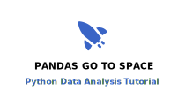

.. pandas_go_to_space documentation master file, created by
   sphinx-quickstart on Sat Jan 28 10:05:39 2023.
   You can adapt this file completely to your liking, but it should at least
   contain the root `toctree` directive.

.. card::
   :shadow: lg
   
   Long long ago, in a galaxy far far away,
   there lived pandas who were traveling space.
   They were peaceful explorers and skilled data scientists.
   
   The pandas sent out their spaceships
   to travel the stars,
   to discover new worlds
   new tastes of bamboo no creature has tasted before
   and to plot all data they found on their way.

This is a Tutorial for Python with pandas
=========================================

This is a Python tutorial featuring the `pandas <https://pandas.pydata.org/>`__ library.
It focuses on the technical basics of Data Science – working with tabular data.
On the way, you will help the pandas explore space.

Contents
--------

.. toctree::
   :maxdepth: 1

   preparations/README.rst
   read_write_data/README.rst
   inspect_data_frames/README.rst
   select_rows_and_columns/README.rst
   edit_columns/README.rst
   data_wrangling/README.rst
   plotting/README.rst
   aggregation/README.rst
   descriptive_statistics/README.rst
   time_series/README.rst
   plotting_maps/README.rst
   create_data_frames/README.rst
   links.rst

.. figure:: huge.jpeg

Image Sources
-------------

Most images for this tutorial were created with the generative neural networks `hotpot.ai <https://hotpot.ai/art-generator>`__
and `deepai.org <https://deepai.org/>`__ . 

The spaceship logo was purchased from `thenounproject.com <https://thenounproject.com/>`__

License
-------

© 2023 Kristian Rother

Unless stated otherwise, the content of this tutorial may be used under the conditions of the **Creative Commons Attribution Share-Alike License 4.0 (CC-BY-SA 4.0)**. 
See `creativecommons.org <https://creativecommons.org/licenses/by-sa/4.0/>`__ .
