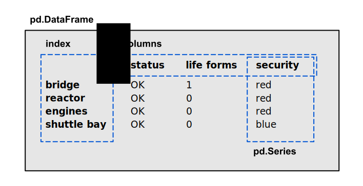

Inspect DataFrames
==================

.. figure:: corridor.jpeg

.. card::
   :shadow: lg

   **Check all Stations**

   Before you can take off, you need to check whether your ship is in a good shape.
   The **Data Starfleet inspection procedure** is to check all stations of the ship,
   and see whether there is anything that requires your attention.
   The ships computer has prepared a **tabular report** already.
   All you need to do is to see what is in the table.

   Load the report :download:`ship_inspection.csv` into a `DataFrame` and check the following commands.

----

What is a DataFrame?
--------------------

The class `pandas.DataFrame` is the central data structure in `pandas`.
In most aspects, you can think of it as a table with row and column labels, also called `Index`.
Each column has the type `pandas.Series`.

----

Inspect a few rows
------------------

You might want to see a few rows. 
In Jupyter, you can do that by typing the variable name in a cell. 
In a Python script, you could `print(df)`.
But you could use the more explicit methods `head()` and `tail()`:

.. code:: python

   df.head(3)
   df.tail(3)

.. dropdown:: Can I call `head()` and `tail()` without a number?
   :animate: fade-in

   Yes. The default number if you leave away the argument is 5.

----

Number of rows and columns
--------------------------

The shape of a `DataFrame` is alway a tuple of two integers `(rows, columns)`.

.. code:: python

   df.shape

.. dropdown:: When do I need to check `df.shape`?
   :animate: fade-in

   `df.shape` is your most important command when debugging.
   If the shape is not what you expect, everything is wrong.

----

Data types
----------

When you load data from a CSV file, `pandas` automatically infers data types.
Sometimes a single wrong value converts a numerical column to strings.

.. code:: python

   df.dtypes

.. dropdown:: What does the type `object` mean?
   :animate: fade-in

   The type `object` usually means that the column contains strings.

----

Generic overview
----------------

You can check data types, the number of entries for each column and memory size with a single command:

.. code:: python

   df.info()

----

Unique values
-------------

With categorical columns, you might want to know, what are the most frequent values or what different values occur.
This also helps you to identify some data errors.

.. code:: python

   df['column_name'].value_counts()

If you are not interested in the count, check the unique values:

.. code:: python

   df['column_name'].unique()

----

Challenge
---------

.. card::
   :shadow: lg

   Inspect the report :download:`ship_inspection.csv`. Solve the following tasks

   - display the number of rows and columns
   - display the last 5 rows
   - list the column names
   - how many life forms are there on the bridge?
   - how many stations does the ship have?
   - how many different security levels are there?
   - there is one life support value that is neither 0 or 100%. How much is it? 
