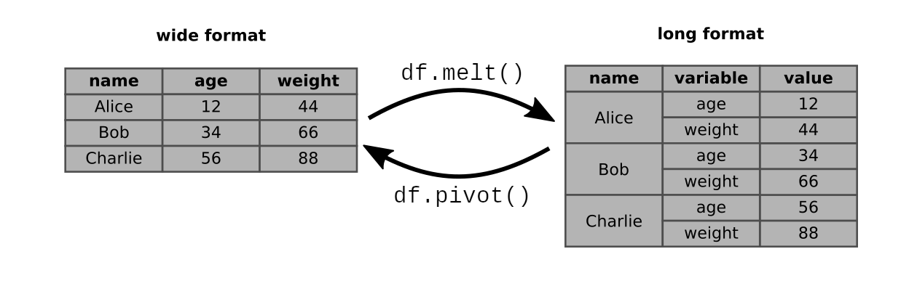

Long vs Wide Format
===================

Data in pandas and tabular data in general can exist in two forms: **long** and **wide** format.

The long format
---------------

In the **long format**, there is exactly one value column.
All other information is moved into the **index**.
In pandas this is in the form of a `MultiIndex`.
As a result, you have a column with very many names.

One way to get closer to the long format is to use `df.groupby()`:

.. code:: python3

    df = sns.load_dataset("penguins")
    df.reset_index(inplace=True)
    del df["island"]
    df2 = df.groupby(["id", "species", "sex"])

If all your columns have the same data type, you can use `df.stack()` to convert data intto the long format:

.. code:: python3

    long = df2.stack()

.. hint::

    ``df.melt()`` in the picture works quite similar to ``df.stack()``
    
The wide format
---------------

In the **wide format**, each variable has its own column.
As a result you have multiple columns and fewer rows.

With `df.unstack(n)` you convert data from the long format.

.. code:: python3

    wide = long.unstack(0)

The conversion between long and wide format helps you to bring data into the right format for merging, concatenation or plotting.

.. hint::

   Before applying the transformations, make sure that your data is **Tidy Data**. Once your data is tidy, transformations from one format to the other will become simple.

----

Pivoting/Crosstables
--------------------

Often, you do not need to stack **all** the columns.
Many useful analyses group by two variables, followed by an **aggregation** and ``df.unstack()``:

.. code:: python3

   pivot = df.groupby(["species", "sex"])["bill_length_mm"].mean().unstack()

The result is also called a **Pivot table** or **Crosstable**.
They are often starting points for useful visualizations of the data.

.. code:: python3

    pivot.plot()
   
----

Key Commands
------------

========================================= =====================================================
command                                   description
========================================= =====================================================
:py:meth:`pandas.DataFrame.set_index`     moves one column into the index
:py:meth:`pandas.DataFrame.reset_index`   moves the index into a column
:py:meth:`pandas.DataFrame.stack`         moves columns to hierarchical row index
:py:meth:`pandas.DataFrame.melt`          converts a df from wide to long format
:py:meth:`pandas.DataFrame.unstack`       creates columns from hierarchical row index
:py:meth:`pandas.DataFrame.pivot`         converts a df from long to wide format
:py:meth:`pandas.DataFrame.transpose`     swaps rows and columns
:py:meth:`pandas.DataFrame.rename`        rename values in the column or row index
========================================= =====================================================
