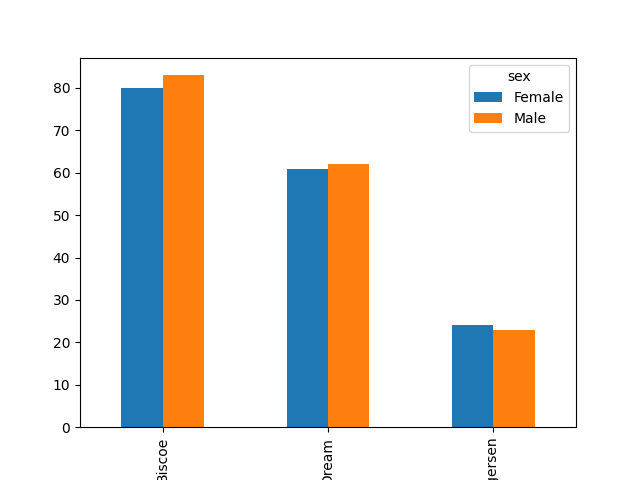

Pivot Tables
============

Penguin Tribes
--------------

.. card::
   :shadow: lg

   Your scientists come with exciting news: they have discovered that **the penguins are also black and white**! Maybe both people have emerged from the same space-traveling ancestor?

   There seem to be three big tribes of penguins with remarkably distinct heads:

   .. figure:: penguin_heads.png

   *Palmerpenguins Artwork by @allison_horst*

   You need to find more about them!

   .. code:: python3
     
      import seaborn as sns

      df = sns.load_dataset("penguins")

Pivot Tables
------------

A **pivot table** is a generic summary of tabular data that is well-known from spreadsheet tools.
It creates a table where the rows and colums are defined by categorical columns of the data.

To create a simple pivot of your data, you need to have at least **one categorical and one numerical column and a function that aggregates data**:
::

   categories + numbers + aggregation function -> pivot

Let's examine one example:

.. code:: python3

   pd.pivot_table(
      data=df,
      index="island",
      values="bill_length_mm",
      aggfunc="mean"
   )
   
Here, each distinct value in ``index`` results in a separate row. The ``values`` parameter defines which column will be used for aggregation.

Pivot Tables with rows and columns
----------------------------------
Many times, you will use two categorical columns so that the pivot table has multiple columns.
In that case, one categorical column defines the rows, the other defines the columns of the pivot table:

::

   categories1 + categories2 + numbers + aggregation function -> pivot

The code requires one more line:

.. code:: python3

   pd.pivot_table(
      data=df,
      index="island",
      columns="sex",
      values="bill_length_mm",
      aggfunc="count"
   )

The ``column`` parameter lets each distinct gender result in a separate column.
Counting works with any column as ``values``, but ``None`` is ignored.

Aggregation Functions
---------------------

There are just a few aggregation functions that cover most statistical functions:

- count
- sum
- mean
- std (the standard deviation)
- min
- max

You could use your own functions with ``pd.pivot_table`` but this is out of scope for this tutorial.

Normalizing
-----------

When creating pivot tables with count data, you often will want to know the **relative frequencies** or **percentage** of each item. This is an example of **normalizing data**.

Assume we have the pivot:

.. code:: python3

   piv = pd.pivot_table(
      data=df,
      index="island",
      columns="sex",
      values="bill_length_mm",
      aggfunc="count"
   )

You can normalize over the rows, so that the relative frequencies sum up to 1.0 for each island:

.. code:: python3

   piv / piv.sum()

If you want to normalize for each gender instead, you need to transpose the table first:

.. code:: python3

   piv.T / piv.T.sum()

Finally, to normalize the entire table, so that everything adds up to 1.0, you need to divide by the **grand total**:

.. code:: python3

   piv / piv.sum().sum()

Bar Plots
---------

One key feature of pivot tables is that they reduce the size of the data considerably.
The pivoted data usually can be displayed well as a **bar plot**: 

.. code:: python3

   piv.plot.bar()

This works for all pivots and their normalizations!

Challenge
---------

.. card::
   :shadow: lg

   Examine the penguin scan data further:

   .. code:: python3

      import seaborn as sns

      df = sns.load_dataset('penguins')

   Answer the following questions:

   1. how many penguins are in which species?
   2. how many penguins from which species live on which island?
   3. what is the average body mass of each species?
   4. how long is the longest beak of each species?
   5. what is the mean of each numerical column, per species?
   6. what is the mean bill length and depth for each species/sex combination?
