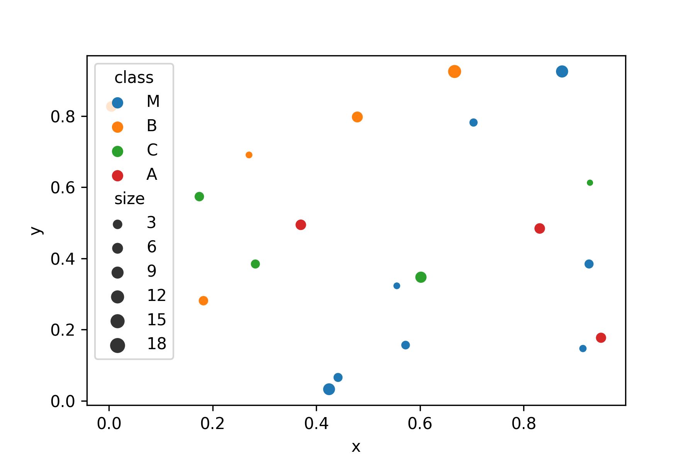

High-Quality Plots
==================

Navigation
----------

.. card::
   :shadow: lg

   Your crew needs an accurate and detailed map to navigate.
   Of course, they want to see the map on the huge screen on the bridge.
   
   Let's work through the **Data Starfleet Procedure to create a high-quality diagram**.

----

Step 1: Import packages
-----------------------

When using the pandas/matplotlib/seaborn stack, your imports should look as follows:

.. code:: python

   import pandas as pd
   import seaborn as sns
   from matplotlib import pyplot as plt

----

Step 2: Start with clean data
-----------------------------

Many problems with plotting result from unclean data.
Make sure the data you are using is clean and consistent:

* make sure columns and rows are labeled
* check the data types of the columns you want to plot
* few missing values
 
Pandas by default kicks out rows with missing data when plotting, but for your final plots you want to be firmly in control.
Here is a clean version of the planets in **panda sector:** :download:`panda_sector.csv <../read_write_data/panda_sector.csv>`

.. code:: python

   df = pd.read_csv('panda_sector.csv', index_col=0)

----

Step 3: Plot with default settings
----------------------------------

Use one of the standard `seaborn` functions to see whether the data contains what you need.
Most parameters of `seaborn` refer directly to column names:

.. code:: python

   sns.scatterplot(data=df, x='x', y='y', hue='class', size='size')

For an exploratory analysis, the default pandas functions are also a valid starting point, but they have fewer options:

.. code:: python

   df.plot.scatter(x='x', y='y')

To improve the plot, use `matplotlib`, a library both `pandas` plotting functions and `seaborn` are based on.

----

Step 4: Format the axes
-----------------------

You may want to adjust the axis limits to add a bit of empty space on the sides.
After all, there is plenty of empty space in space.
Also, you may want to label each axis. 
Note that you may use *LaTeX math notation*. 

.. code:: python

   sns.scatterplot(data=df, x='x', y='y', hue='class', size='size')
   plt.xlim(-10, 110)
   plt.ylim(-10, 110)
   plt.xticks(color="white")
   plt.yticks(color="white")
   plt.tick_params(color="white")
   plt.xlabel("x coordinate in $\sqrt{warps}$", color="white")
   plt.ylabel("y coordinate in $\sqrt{warps}$", color="#ffffff")
   plt.xticks(color="white")

----

Step 5: Add a grid
------------------

A grid makes it easier to see the x/y values.

.. code:: python

   sns.scatterplot(data=df, x='x', y='y', hue='class', size='size')
   plt.grid()

----

Step 6: Add points of interest
------------------------------

There is a black hole in the middle of the panda sector.
It is technically not a planet, so it does not appear in your database.
But you should draw it on the star map with a big arrow, so that you don't accidentally get sucked into it.

.. code:: python
   
   sns.scatterplot(data=df, x='x', y='y', hue='class', size='size')
   
   plt.annotate('black hole $\epsilon_{23}$',
                xy=(0.6, 0.6),
                xycoords='data',
                xytext=(-90, -50),
                textcoords='offset points',
                fontsize=12,
                color="red",
                arrowprops={
                    'arrowstyle': "->",
                    'connectionstyle': "arc3,rad=.2",
                    'color': "red"
                })

----

Step 7: Add a title
-------------------

This step is crucial to understand the plot.
You want everybody to be clear in which sector you are even if they overslept the last few hyperjumps.

.. code:: python

   sns.scatterplot(data=df, x='x', y='y', hue='class', size='size')
   plt.title('Panda sector x/y projection', color="black")

----

Step 8: Figure size
-------------------

You may want a bigger image on the screen so that the officers in the back of the bridge can see everything.
For historic reasons, the size of matplotlib figures (and Data Starfleet displays) is measured in inches.

.. code::

   plt.figure(figsize=(11, 7))
   sns.scatterplot(data=df, x='x', y='y', hue='class', size='size')

----

Step 9: Export the image
------------------------

Finally, make the map available as an image file. Here is where you define the final resolution in pixels.
To convert from inches to pixels, the starfleet uses the ancient metric `dpi` (dots per inch):

.. code::

   pixels = figure size inches * dpi

A number of image formats including png, jpg and svg are available.

----

Challenge
---------

.. card::
   :shadow: lg

   Create a big scatterplot from the planets from all three sectors.
   Apply the code from all steps above and fine-tune the image.   

   **data:**
   
   - :download:`panda_sector.csv <../read_write_data/panda_sector.csv>`
   - :download:`penguin_sector.csv <../read_write_data/penguin_sector.csv>`
   - :download:`amoeba_sector.csv <../read_write_data/amoeba_sector.csv>`
