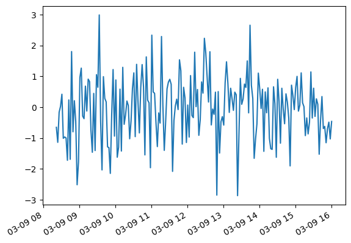
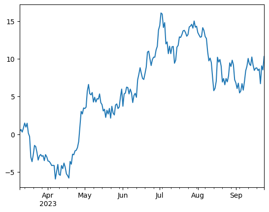

Time Series
===========

Gravity Rift
------------

.. card::
   :shadow: lg

   **Alert!** The anti-matter reactor of the ship has become unstable.
   High-energy particles drift in random directions.
   You manage to avoid turning your ship into a fireball by throwing the anti-matter out through a hatch just in time.
   As it is the matter with anti-matter, it messes with the time-space continuum.

   In this case, it creates a gravity rift that sucks you in.
   Your ship pops out in a completely different space and time, next to a habitable planet.
   Judging by the air pollution, you ended up in the early 21st century.

   Fortunately, you should be able to make it back from this barbaric place.
   All you need to do is to find out when the gravity displacement is the biggest.
   Then, you should be able to open another rift and jump back to your own world.

   You find the gravity displacement data over time in :download:`gravity.csv`.
   
   Use the local time system to calibrate the time.

.. dropdown:: The pollution phrase looks familiar. Who is it from?
   :animate: fade-in

   This is a reference to the legendary Leonard Nimoy in `Star Trek IV: The Voyage Home <https://en.wikipedia.org/wiki/Star_Trek_IV:_The_Voyage_Home>`__

Create a Time Series
--------------------

Handling timestamps is one of the strongest features in ``pandas``.
Most of the time, you will want the timestamps to be in the **row index**.
With :py:func:`pandas.date_range` you can create series of timestamps from scratch:

.. code:: python3

    import pandas as pd

    s = pd.Series(
        data = displacement,
        index = pd.date_range("2023-03-09", freq="D", periods=200),
        name = "reactor_temp",
    )
    s.head()

Instead of a ``pd.Series`` object you could also use a DataFrame, allowing for multiple columns.
In both cases, a ``pandas.DateTimeIndex`` is used to track data over time.

You could also create timestamps specifying both boundaries and a number of periods:

.. code:: python3

    pd.date_range("2023-03-09 08:22:00", "2023-03-09 16:00:00", periods=200),

----

Timestamps from Strings
-----------------------

Parsing strings to timestamps is very convenient.
``pandas`` understands plenty of different formats.
This makes your life much easier, e.g. when parsing the log files of an anti-matter reactor.

.. code:: python3

    pd.to_datetime(
        ["2020", "September 16th, 2020", "2020 Sep 16 11:11", "2020/09/16", "09/16/2020"],
        day_first=False
    )

Technically, the timestamps are stored in integers and measured in nanoseconds since the **Unix epoch on Jan 1st, 1970** when the first Unix machine officially started to tick.

.. note::

   When reading timestamp columns from a CSV file, the option ``parse_dates=True`` is a useful shortcut if the timestamp is the index. Otherwise ``parse_dates=['col_name']`` works as well.

----

Plotting Time Series
--------------------

When plotting a time series, ``pandas`` automatically uses the time index for the x-axis:

.. code:: python3

    s.plot()

A frequently used trick is to sum up values with a **cumulative sum**.
The **random data** becomes a **random walk**.
You see that the small changes add up over time and the data is drifting.
Note that the resulting data still has a similar timestamp index:

.. code:: python3

    ts = s.cumsum()
    ts.plot()

``pandas`` decides on the fly whiich scale and which ticks to use for the x-axis.
This works well almost all the time:

----

Accessing DateTime Attributes
-----------------------------

Every **DateTimeIndex** has a couple of useful fields that can be accessed:

.. code:: python3

    ts.index.year
    ts.index.month
    ts.index.hour
    ts.index.weekday
    ts.index.minute
    ts.index.month_name()
    ts.index.day_name()

----

Indexing and Slicing
--------------------

Timestamp indexes can be indexed and sliced comfortably using string intervals:

.. code:: python3

    ts['1/10/2011']
    ts["2023-03-20":"2023-04-17"]
    ts[datetime(2011, 1, 7):]
    ts['1/6/2011':'1/11/2011']

----

Resampling
----------

A frequent task is changing rows so that different intervals between the time stamps are used.
There are two types of resampling.

**Downsampling** condenses the data (fewer rows).
Like with ``df.groupby()``, you need to specify, how the rows should be aggregated:

.. code:: python3

    ts.resample("1M").mean()
    ts.resample("2W").sum()
    ts.resample("10d").first()

**Upsampling** changes the index to a wider timescale (more rows).
The resulting gaps need to be filled or interpolated, otherwise they stay empty:

.. code:: python3

    ts.resample("6h10min").first()
    ts.resample("6h10min3s").ffill()
    ts.resample("6h").first().interpolate()

.. seealso::

   Check out the table with Offset aliases in the `pandas Time Series documentation <https://pandas.pydata.org/pandas-docs/stable/user_guide/timeseries.html#offset-aliases>`__

----

Rolling Mean
------------

A frequent type of aggregation is the **rolling mean** (or moving average).
It shifts a window of N data points over the time series and returns a value for each position.
This smoothes out noise in the data.

.. code:: python3

    ts.rolling(window=10).mean()
    ts.rolling(window=10).std()
    
    ts.rolling(window=10).mean().plot()

Try different window sizes and see how the curve becomes smoother and smoother.
``.rolling()`` also works for rolling standard deviations and custom functions.

.. seealso::

   You can find more examples in the `pandas documentation <https://pandas.pydata.org/pandas-docs/stable/timeseries.html>`__

----

Challenge
---------

.. card::
   :shadow: lg

   To find out when you need to jump back, solve the following tasks:

   1. create timestamps for an entire year (2025), one per day

   2. create a ``pd.Series`` with the gravity and the timestamps as index

   3. display the weekday for each timestamp. On Sunday, your chef will be cooking bamboo with mushrooms, so no time travel on that day.

   4. select the data after January. Time traveling before January is strictly forbidden.

   5. calculate the sum of all gravity displacements for each of the remaining 11 months

   6. calculate a rolling average with a 7-day window.

   7. plot the rolling average data. The day with the highest average is where you should time-travel.

.. dropdown:: How to create time-rift data?
   :animate: fade-in

   Here is the code. Use it at your own risk!

   .. code:: python3

      import numpy as np
      import pandas as pd
      from matplotlib import pyplot as plt

      noise = np.random.normal(size=365)

      x = np.linspace(0, 40, 365)
      y = np.sin(x)
      yy = y + noise
      s = pd.Series(yy)
      s.to_csv("gravity.csv")
